# Kwara state density and vector data
Gerry Ryan
2023-07-26

## Urban density

### Built volume base layer

The basis for these is the [GHS built-up volume
grid](https://ghsl.jrc.ec.europa.eu/ghs_buV2023.php) produced by the
European Commission Joint Research Council, which measures the bult
volume in cubic metres over space.

#### Kwara state

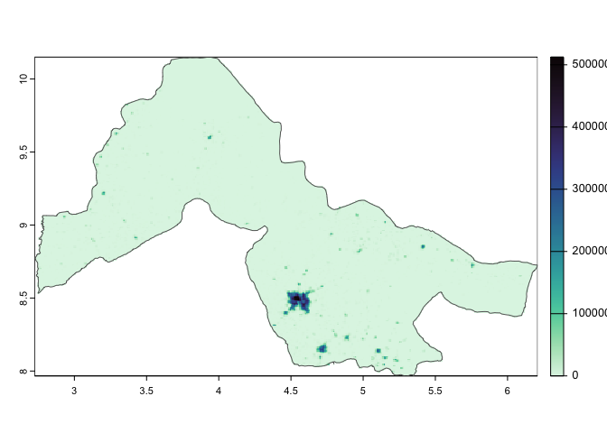

#### Ilorin city

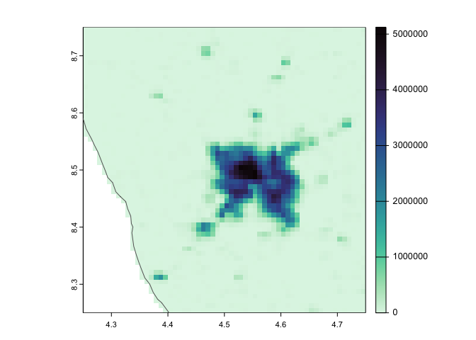

### Classification into density classes

#### Kwara state, 3 classes

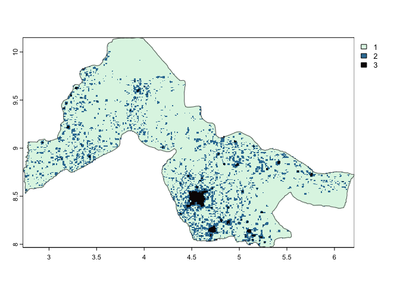

#### Kwara state 6 classes

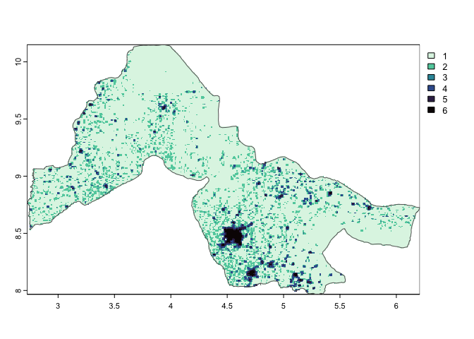

#### Ilorin city 3 classes

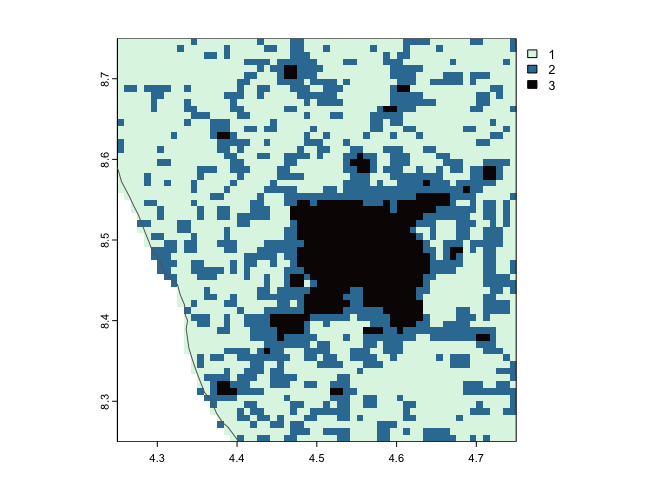

#### Ilorin city six classes:

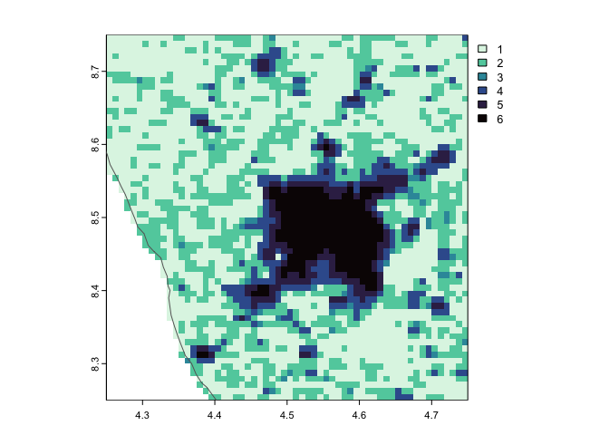

## Proportional abundance of dominant vectors

These plots are from [*Modelling the relative abundance of the primary
African vectors of malaria before and after the implementation of
indoor, insecticide-based vector control*, Sinka et
al. 2016](https://doi.org/10.1186/s12936-016-1187-8), cropped to Kwara
state. The

### Base proportional abundance of *Anopheles gambiae*, *An. funestus*, and *An gambiae*

This map shows the baseline relative proportional abundance of the three
dominant vectors.

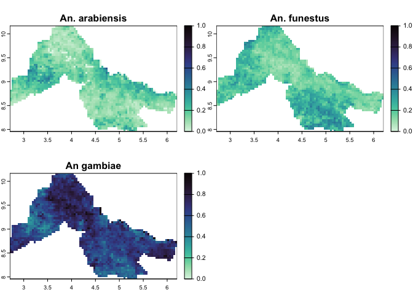

### After IRS

#### Proportional relative abundance post-IRS

This shows the expected proportional abundance after the application of
IRS

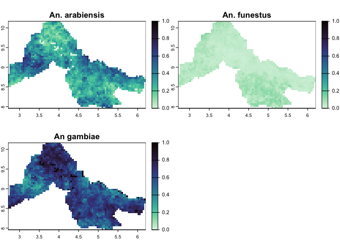

#### Change in proportion after IRS

This is the differnce between the base proportional relative abundance,
and the post-IRS proportional abundance (the previous two maps). Where
it is green, the species is expected to be relatively more dominant
post-IRS, and where it is purple it is expected to be relatively less
dominant post-IRS

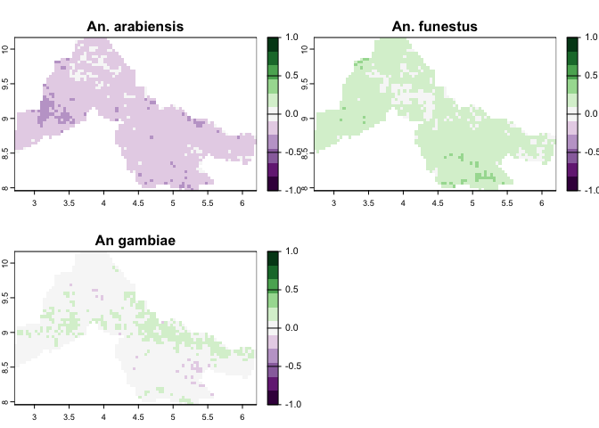

### After ITN use

#### Proportional relative abundance post-ITN use

This shows the expected proportional abundance after the distribution of
ITNs

#### Change in proportion after ITN use

This is the difference between the base proportional relative abundance,
and the post-ITN proportional abundance (the first relative abundance
map, and the previous map). Where it is green, the species is expected
to be relatively more dominant post-IRS, and where it is purple it is
expected to be relatively less dominant post-ITN distribution

## Insecticide resistance

These plots are from [*Mapping trends in insecticide resistance
phenotypes in African malaria vectors*, Hancock et al
2020](https://doi.org/10.1186/s12936-016-1187-8), cropped to Kwara
state.

### Alphacypermethrin

Predicted mean proportional mortality to **alphacypermethrin** in Kwara
state. Low values (dark colours) indicate low mortality, meaning high
resistance to this insecticide

### DDT

Predicted mean proportional mortality to **DDT** in Kwara state. Low
values (dark colours) indicate low mortality, meaning high resistance to
this insecticide

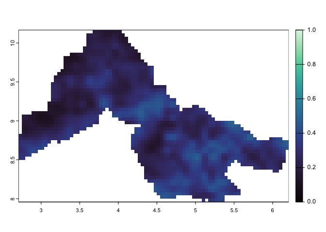

### Deltamethrin

Predicted mean proportional mortality to **deltamethrin** in Kwara
state. Low values (dark colours) indicate low mortality, meaning high
resistance to this insecticide

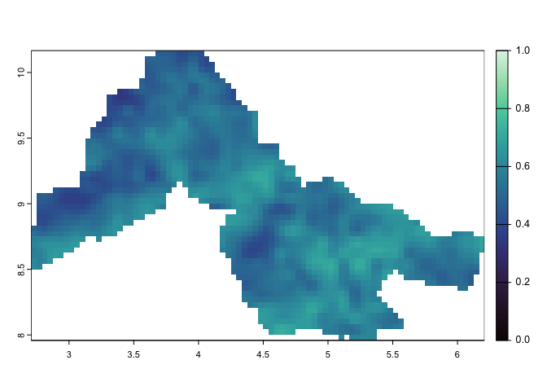

### Lambdacyhalothrin

Predicted mean proportional mortality to **lambdacyhalothrin** in Kwara
state. Low values (dark colours) indicate low mortality, meaning high
resistance to this insecticide

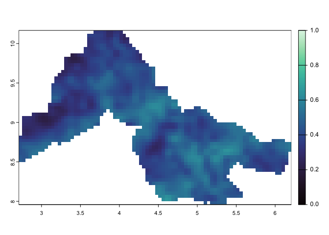

### Permethrin

Predicted mean proportional mortality to **permethrin** in Kwara state.
Low values (dark colours) indicate low mortality, meaning high
resistance to this insecticide

