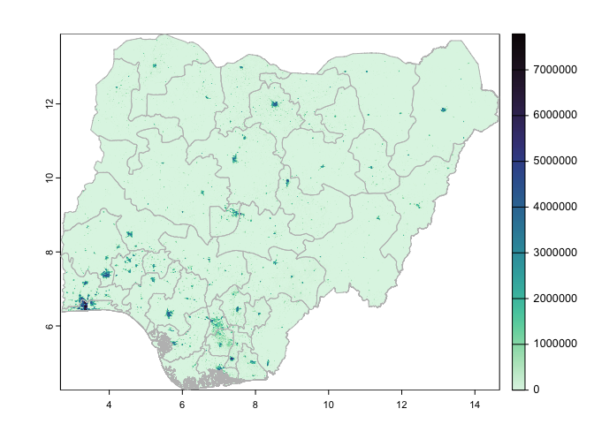
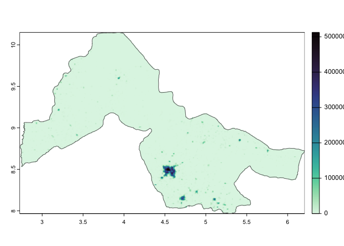
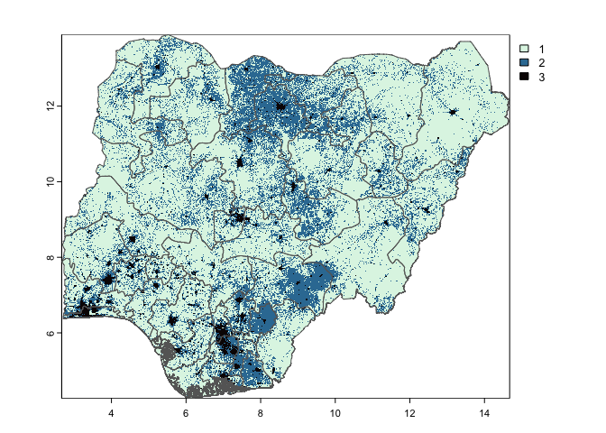
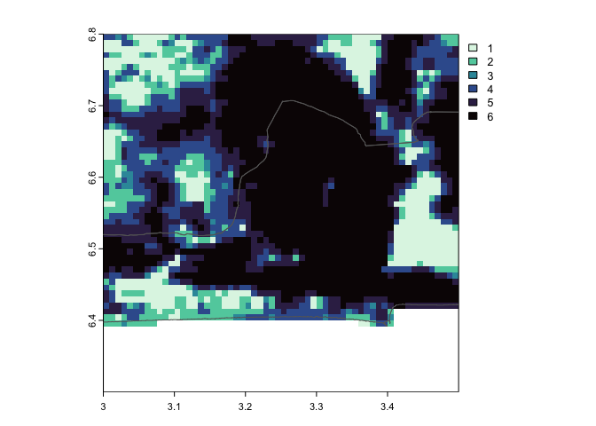

# Urban density classification for Nigeria
Gerry Ryan
2023-07-26

This is a preliminary classification of urban density based on volume of
built structures in an area for Nigeria.

The basis for these classifications is the [GHS built-up volume
grid](https://ghsl.jrc.ec.europa.eu/ghs_buV2023.php) produced by the
European Commission Joint Research Council, which measures the bult
volume in cubic metres over space.

## Base layer of built structure volume

Here is the base layer for all of Nigeria:

And focussed in on the south-west of the country in Lagos and Ogun
states:

Close up of Lagos city:

And here Kwara state only

And a close up of Ilorin city:

## Classification

Using Jenks natural breaks classification of the cubed root of
volume[^1] we classify these into either three density classes:

Or six density classes:

### Lagos and Ogun states

This is the same data as above focussing on Lagos and Ogun states for 3
classes:

And six classes:

### Lagos city

Close up of Lagos city for 3 classes:

And six classes:

### Kwara state

Kwara state for 3 classes:

And six classes:

### Ilorin city

And the area around Ilorin city state for 3 classes:

And six classes:

[^1]: This is done to ‘flatten’ the volumes to allowing for greater
    differentiation among the lower end of the scale, and relatively
    less differentiation at the upper end, e.g. among very tall
    buildings
